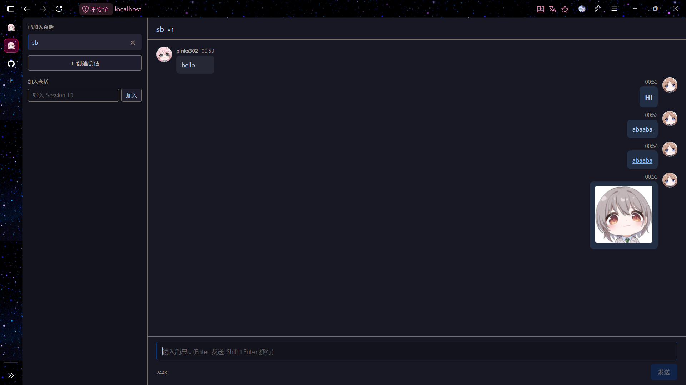

# BSChat

一个 Browser/Server 结构的聊天网站，起因只是最近浅学 Go 想造点轮子，所以前端界面完全由 AI 编写，详见 [RPD](web/DeepSeek大人阅.md)。
起初不太了解 Go 的命名规范，后面想改用驼峰命名为时已晚，下次一定下次一定。

### 预览



### 使用

```shell
git clone https://github.com/BreakTheMyth/bs-chat.git
cd bs-chat
vim config/config.go # 自备证书，设置证书路径 SERVER_CRT 与 SERVER_KEY
make
./bs-chat
```

